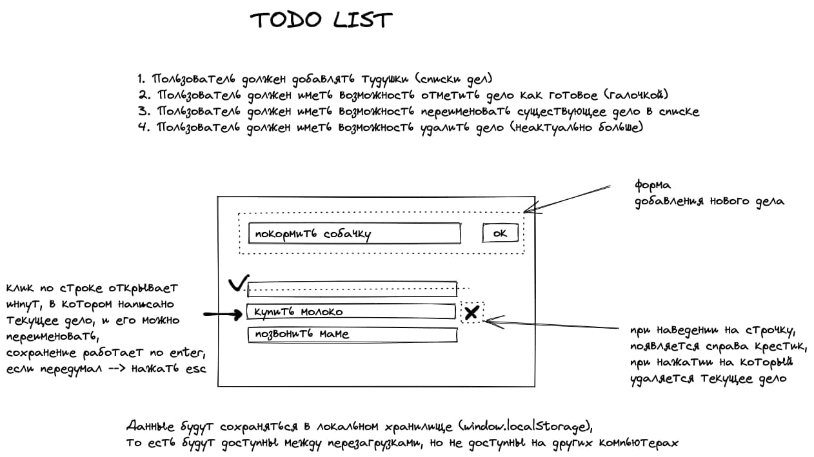

# Todo List
Учебный проект по созданию приложения "Todo List" на чистом JavaScript с использованием LocalStorage.

## Функциональность

## Архитектура
1. form-add-to-do
	- __input
	- __submit
2. todo-list
3. todo-item
	- __name
	- __tick
	- __cancel
	- __input
4. header
	- __title
5. footer

